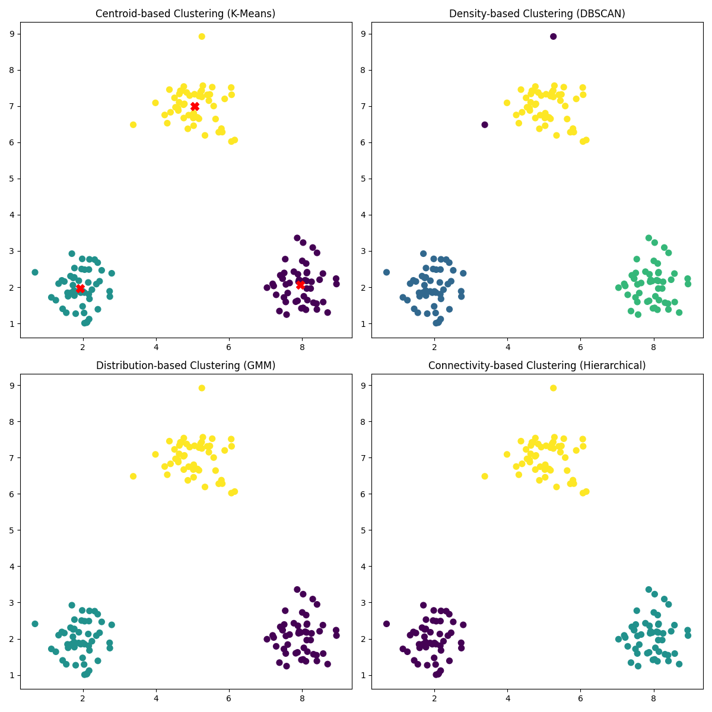

# Resultados dos Métodos de Clusterização

## 1. Clusterização por Centróides (K-Means)
- **Resultado**: Os dados foram agrupados em três clusters bem definidos com centróides marcados em vermelho.
- **Observação**: É eficiente e rápido, mas exige o número de clusters como entrada.

---

## 2. Clusterização por Densidade (DBSCAN)
- **Resultado**: Identificou os clusters densos corretamente e marcou outliers como um grupo separado.
- **Observação**: Funciona bem para dados de forma irregular, mas pode ser sensível aos parâmetros (`eps` e `min_samples`).

---

## 3. Clusterização por Distribuição (GMM)
- **Resultado**: Agrupou os pontos com base em distribuições gaussianas, permitindo uma divisão mais flexível.
- **Observação**: Permite sobreposição de clusters, mas exige que o número de clusters seja especificado.

---

## 4. Clusterização por Conectividade (Hierarchical Clustering)
- **Resultado**: Os clusters foram criados em níveis hierárquicos, aqui ajustados para três grupos.
- **Observação**: Útil para explorar relações hierárquicas, mas pode ser computacionalmente intensivo para grandes conjuntos de dados.
